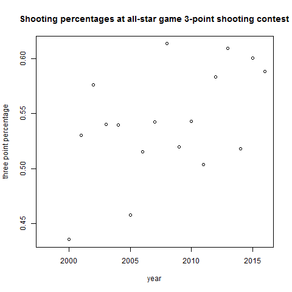
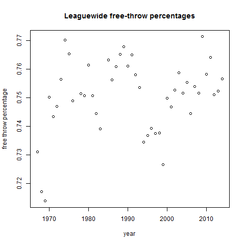
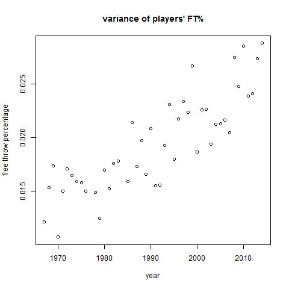
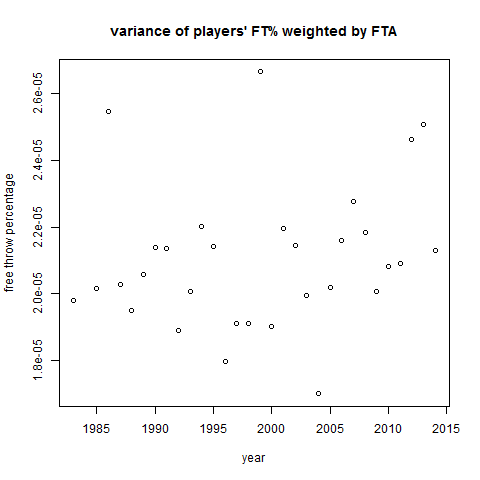

Free throw data from www.basketball-reference.com. Three point data compiled by Lang Whitaker at ESPN.

clear trend

Also a clear trend from the mid 90s. what is the cause of the dip in early 90s? No good data on 3pt% from that period.

Clear trend especially in unweighted case
